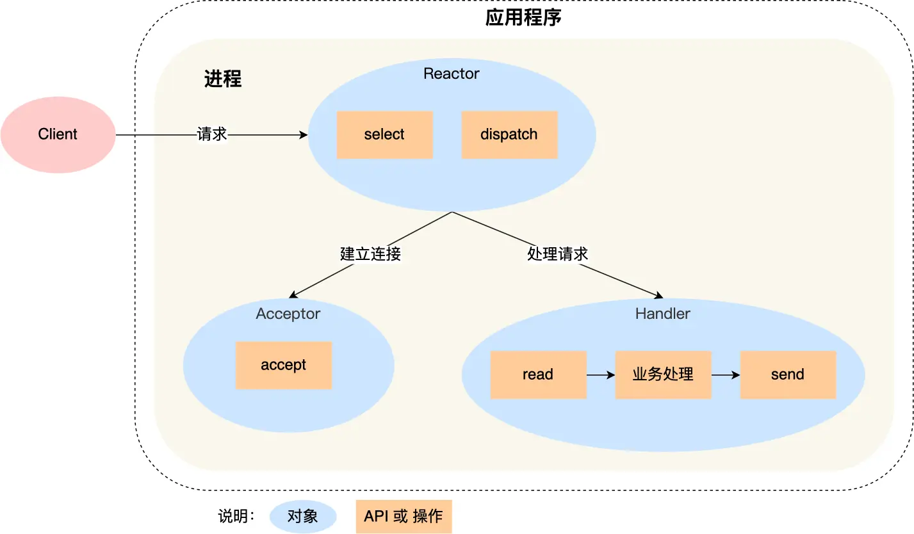
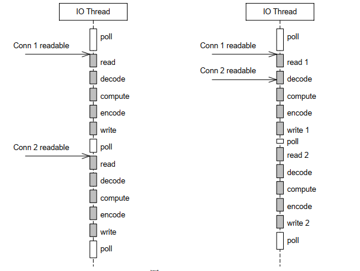
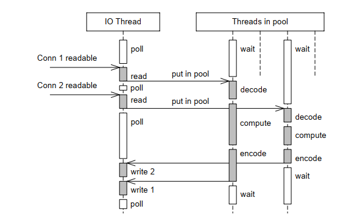
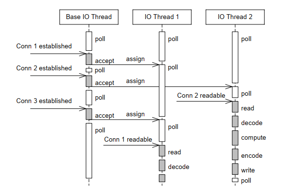
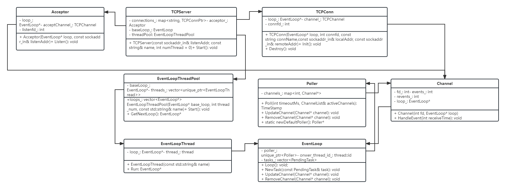
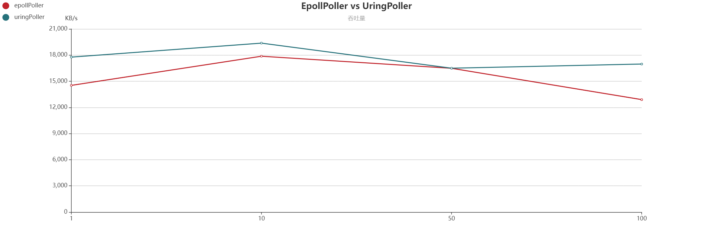
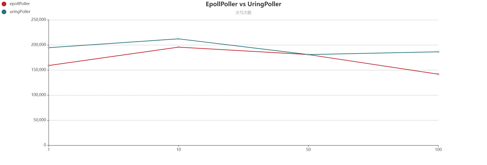

# 实验报告
# 姓名：倪孝泽；学号：202121080528
# 项目介绍
- 模仿 muduo 项目，实现一个 Reactor 模式服务器模型，实现 EPOLL 以及 URING 两种 Poller
- 实现两个 Channel，分别是 TCPChannel 以及 FILEChannel
- 功能测试以及性能测试

## 1. Reactor 模式
`Reactor` 模式也叫 `Dispatcher` 模式，即 I/O 多路复用（SELECT/POLL/EPOLL）监听事件，收到事件后，根据事件类型分配（Dispatch）给某个进程 / 线程。

`Reactor` 模式主要由 `Reactor` 和处理资源池这两个核心部分组成，它俩负责的事情如下：
1. Reactor 负责监听和分发事件，事件类型包含连接事件、读写事件；
2. 处理资源池负责处理事件，如 read -> 业务逻辑处理 -> send；

一个典型的 Reactor 服务器模式架构如下图所示：


应用程序里面有  Reactor、Acceptor、Handler 这三个对象：
- Reactor 对象的作用是监听和分发事件；
- Acceptor 对象的作用是获取连接；
- Handler 对象的作用是处理业务；

1. Reactor 对象通过 IO 多路复用接口监听事件，收到事件后通过 dispatch 进行分发，具体分发给 Acceptor 对象还是 Handler 对象，还要看收到的事件类型；
2. 如果是连接建立的事件，则交由 Acceptor 对象进行处理，Acceptor 对象会通过 accept 方法获取连接，并创建一个 Handler 对象来处理后续的响应事件；
3. 如果不是连接建立事件， 则交由当前连接对应的 Handler 对象来进行响应；
4. Handler 对象通过 read -> 业务处理 -> send 的流程来完成完整的业务流程。

## 2. muduo 的多线程模型
muduo 中的多线程模型分为以下几种：
|编号|名称|接收新连接|网络 IO|计算任务|
|--|--|--|--|--|
|1|thread-per-connection|1 个线程|N 个线程|在网络线程中进行|
|2|单线程 Reactor|1 个线程|在连接线程中进行|在连接线程中进行|
|3|Reactor + 线程池|1 个线程|在连接线程中进行|C2个 线程|
|4|one loop per thread|1 个线程|C1 个线程|在网络线程中进行|
|5|one loop per thread + 线程池|1 个线程|C1 个线程|C2 个线程|

### 2.1. thread-per-connection
它的主要思想是通过一个线程接收新的连接，然后为每个新的连接创建对应的线程，各个线程负责从网络中读取并处理请求。这是传统的 Java 网络编程方案，这种方案不适合短连接服务，当连接数（创建）的线程数目过多时，将会对操作系统的调度过程产生不小的负担。

### 2.2. 单线程 Reactor
单线程 Reactor 模式如下图所示：


其对新连接的建立、网络请求的读取以及网络请求的处理都是在一个线程中进行的，采用 IO 多路复用的方式来对套接字进行监听。同时，需要注意的是，当它在处理网络请求的时候，它是无法接收新的连接的。因此，它只适合 IO 密集的应用，不太适合 CPU 密集的应用，因为较难发挥多核的威力。

### 2.3. Reactor + 线程池
这是对上面的单线程 Reactor 模式的改进，如下图所示：


全部的 IO 工作都在一个 Reactor 线程完成，而计算任务交给线程池中的线程处理。如果计算任务彼此独立，而且 IO 的压力不大，那么这种方案是非常适用的。

### 2.4. one loop per thread
如果 IO 的压力比较大，一个 Reactor 处理不过来。那么就应该采用这种方案，这是 muduo 内置默认的多线程方案，也是 Netty 内置的多线程方案。如下图所示：


它有一个 mainReactor 负责 accept(2) 连接，然后把连接挂在某个 subReactor 中（muduo 采用 round-robin 的方式来选择 sub Reactor），这样该连接的所有操作（网络 IO 以及处理）都在那个 subReactor 所处的线程中完成。多个连接可能被分派到多个线程中，以充分利用 CPU。

### 2.5. one loop per thread + 线程池
通过将 2.3 以及 2.4 的方案结合，既使用多个 Reactor 来处理 IO，又使用线程
池来处理计算。这种方案适合既有突发 IO （利用多线程处理多个连接上的 IO），又有突发计算的应用（利用线程池把一个连接上的计算任务分配给多个线程去做）。如下图所示：

## 3. 系统实现
系统中主要的源文件包括 `TCPServer.cpp, Acceptor.cpp ,TCPConn.cpp, Channel.cpp, EventLoopThreadPool.cpp, EventLoopThread.cpp, EventLoop.cpp` 以及两个不同的 Poller，分别是 `UringPoller.cpp, EpollPoller.cpp`。另外，针对文件操作，我们还实现了一个 `FILEOperator.cpp`。各个源文件中的类之间的关系如下：


### 3.1. 各个类的作用
#### TCPServer
首先，TCPServer 是创建一个服务端程序的类，其它的类都被包含在这个类中。我们在 examples 中给出的 echo 服务器就是利用这个类，然后对对应的读请求的响应进行设置。初始化 TCPServer 对象之后，并设置相关的处理函数，通过调用 Start() 函数运行服务器。

TCPServer 中有一个 Acceptor 对象用来接收新的连接，接收到新的连接将会创建一个新的 TCPConn 对象放在一个 map 当中，同时 TCPServer 还记录了当前线程所在的事件循环 baseLoop_ 以及一个线程池 threadPool_，后续建立的新的连接将会由这个线程池中的线程处理。

#### Acceptor
Acceptor 在初始化时将会创建一个套接字 listenfd_ 监听新的连接请求，它会记录其所在的事件循环 loop_，同时创建一个 acceptChannel_ 并加入到事件循环中对后续的新的连接进行处理。

#### TCPConn
在接收到新的连接之后，会创建一个 TCPConn 对象，该对象保存了连接中用来通信的套接字 connfd_，它会记录其所在的事件循环 loop_，同时创建一个 channel_ 并加入到事件循环中对后续在该套接字上发生的读写请求进行处理。

#### Channel
Channel 会在 Acceptor 以及 TCPConn 中创建，其中记录了对应的套接字，其所属的事件循环 loop_，以及该 Channel 希望响应的事件 events_，以及当前收到的事件 revents_。在产生事件时，它的 HandleEvent() 函数将会被调用，根据事件的类型不同，最终会调用到 Acceptor 或者 TCPConn，以及 TCPServer 中注册的回调函数。

#### EventLoopThreadPool
EventLoopThreadPool 管理了线程池中的所有线程，在新的连接建立时，调用其中的 GetNextLoop() 将会在线程池上以 Round Robin 的方式返回一个线程对应的事件循环。

#### EventLoopThread
EventLoopThread 管理了对应事件循环 loop_，以及处理它的线程 thread_。

#### EventLoop
EventLoop 包含了一个 poller，以及所有处于等待状态的任务 task_，它在线程启动后将会在一个循环中不断获取 poller 中响应的事件（或者等待超时），如果有 channel 就绪，那么将执行对应 channel 的回调函数，然后执行 task_ 中的任务。

#### Poller
Poller 中以 map 形式记录所有的 Channel，它有两种实现，分别是 Epoll 以及 Uring。它的虚函数 Poll 将会以 IO 多路复用的形式等待注册的 Channel 中对应的事件产生，UpdateChannel 函数将会向 Poller 注册一个新的 Channel，RemoveChannel 将会从 Poller 中移除对应的 Channel。

#### FILEOperator
FILEOperator 主要是通过 FILEChannel 并结合 Uring 实现多个文件的异步读写，它需要一次将读写请求放入到其中，然后可以异步的等待所有的读写请求完成，并在完成后调用注册的回调函数。

### 3.2. 整个系统的运行流程
这里介绍系统运行在 one loop per thread 状态时的运行流程，这要求线程池中的线程数大于 1.

#### 主线程（Reactor）
Acceptor 运行在主线程，它会接收新的连接，并将对应的连接分发到线程池中的线程。
1. 首先创建一个 TCPServer 对象，并可以设置自定义的回调函数，然后调用 Start() 函数启动；
2. Start 函数会启动线程池，它会创建多个线程然后执行循环（循环的过程将在下面提到）；
3. 然后设置 Acceptor 处于监听状态；
4. 最后设置当前线程进入循环；
5. 当前线程的循环将会不断等待 Acceptor 中的监听套接字就绪，并调用相应的处理函数。

#### 线程池
1. 线程池中的各个线程在系统之后也进入循环；
2. 在循环中它会以 IO 多路服务的形式轮询所有管理的套接字；
3. 如果有套接字就绪，那么就会调用相应的处理函数，对其进行处理；
4. 每一次循环结束时，将会执行所有处于等待队列中的任务。

#### 函数回调
1. 在某个套接字就绪时，轮询（Poll）的过程将会返回该套接字对应的 Channel，并调用对应的 HandleEvent() 函数；
2. HandleEvent 函数将会根据返回事件的类型调用 Acceptor 中的 handleRead() 函数或者 TCPConn 中的 handleXXX() 函数；
3. Acceptor 中的 handleRead() 将会调用 TCPServer::newConnection() 函数，在这个函数中将会把新的连接请求放入对应的事件循环（线程）；
4. TCPConn 中的 handleXXX() 函数将会进行相应的处理，如果用户自定义了相应的处理函数，那么这个函数也会接着调用用户的处理函数。


## 4. 系统构建
通过运行 `build.sh` 脚本对项目进行构建
### 4.1 初始化
在根目录下，运行：
```
./build.sh init
```
这将下载项目相关的依赖项，并对其进行构建。
### 4.2 Debug 模式
在根目录下，运行：
```
./build.sh debug
```
在完成初始化后，运行上述命令，将会以 Debug 模式构建项目，构建结果位于根目录的 debug 子目录下。
### 4.3 Release 模式
在根目录下，运行：
```
./build.sh release
```
在完成初始化后，运行上述命令，将会以 Release 模式构建项目，构建结果位于根目录的 release 子目录下。
### 4.4. 其他
项目需要构建在支持 liburing，且支持 io_uring_prep_send/io_uring_prep_recv/io_uring_prep_accept 的操作系统。

## 5. 系统评估
- `echo_uring.sh` 脚本将会在本机 1234 端口利用 uringPoller 启动一个 echo 服务器；
- `echo_epoll.sh` 脚本将会在本机 1234 端口利用 epollPoller 启动一个 echo 服务器；
- `telnet.sh` 将会运行 telnet 程序连接到本机 1234 端口启动的服务器；
- `benchmark.sh n` 将会同时运行 n 个 pingpong 测试程序与 echo 服务器进行通信，测试服务器性能；
- 注意，在运行这些脚本之前，首先在 release 模式下对项目进行构建。

### 5.1. pingpong
简单地说， ping pong 协议是客户端和服务器都实现 echo 协议。当 TCP 连接立时，客户端向服务器发送一些数据，服务器会 echo 回这些数据，然后客户端再 echo 回服务器。这些数据就会像乒乓球一样在客户端和服务器之间来回传送，直到有一方断开连接为止。这是用来测试吞吐量的常用办法。

### 5.2. EpollPoller vs UringPoller
我们分别运行 1、10、50、100 个 pingpong 进程与我们的 echo 服务器进行通信，每个 pingpong 进程将会与服务器通信 10s，然后断开连接，具体做法如下：
```
// 启动 echo 服务器，并使用 epollPoller
./echo_epoll.sh
// 分别并发启动 1、10、50、100 个 pingpong 进程
./benchmark.sh 1
./benchmark.sh 10
./benchmark.sh 50
./benchmark.sh 100
```

```
// 启动 echo 服务器，并使用 uringPoller
./echo_uring.sh
// 分别并发启动 1、10、50、100 个 pingpong 进程
./benchmark.sh 1
./benchmark.sh 10
./benchmark.sh 50
./benchmark.sh 100
```

对应的测试结果分别位于 epoll_result 以及 uring_result 目录下。

#### 实现结果
实验结果如下图所示：


这两张图分别展示了 10s 内，在 pingpong 进程并发数分别为 1、10、50、100 时，echo 服务器的吞吐量以及交互次数。 UringPoller 在这两项指标上都优于 EpollPoller。

### 5.3. FileChannel
我们在 fileop 文件下运行 fileop.sh，它将会运行 fileop 程序，这个程序将同时打开 10 个文件从中读取，并打开 10 个文件往其中写入。读取和写入完成之后将会调用相应的回调函数，显示读取或者打印成功。


## 6. 依赖项
- 本项目依赖于 [liburing](https://github.com/axboe/liburing)，它是对 io_uring 的封装，提供一个更方便得 uring 编程库；
- 本项目依赖 [glog](https://github.com/google/glog)，实现项目运行过程中的状态打印，跟踪服务器状态；