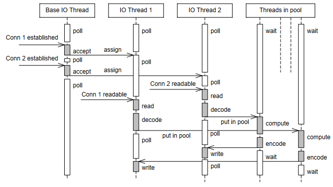

# 项目介绍
- 模仿 muduo 项目，实现一个 Reactor 模式服务器模型，实现 EPOLL 以及 URING 两种 Poller
- 实现两个 Channel，分别是 TCPChannel 以及 FILEChannel
- 功能测试以及性能测试

## 1. Reactor 模式
`Reactor` 模式也叫 `Dispatcher` 模式，即 I/O 多路复用（SELECT/POLL/EPOLL）监听事件，收到事件后，根据事件类型分配（Dispatch）给某个进程 / 线程。

`Reactor` 模式主要由 `Reactor` 和处理资源池这两个核心部分组成，它俩负责的事情如下：
1. Reactor 负责监听和分发事件，事件类型包含连接事件、读写事件；
2. 处理资源池负责处理事件，如 read -> 业务逻辑处理 -> send；

一个典型的 Reactor 服务器模式架构如下图所示：


应用程序里面有  Reactor、Acceptor、Handler 这三个对象：
- Reactor 对象的作用是监听和分发事件；
- Acceptor 对象的作用是获取连接；
- Handler 对象的作用是处理业务；

1. Reactor 对象通过 IO 多路复用接口监听事件，收到事件后通过 dispatch 进行分发，具体分发给 Acceptor 对象还是 Handler 对象，还要看收到的事件类型；
2. 如果是连接建立的事件，则交由 Acceptor 对象进行处理，Acceptor 对象会通过 accept 方法获取连接，并创建一个 Handler 对象来处理后续的响应事件；
3. 如果不是连接建立事件， 则交由当前连接对应的 Handler 对象来进行响应；
4. Handler 对象通过 read -> 业务处理 -> send 的流程来完成完整的业务流程。

## 2. muduo 的多线程模型
muduo 中的多线程模型分为以下几种：
|编号|名称|接收新连接|网络 IO|计算任务|
|--|--|--|--|--|
|1|thread-per-connection|1 个线程|N 个线程|在网络线程中进行|
|2|单线程 Reactor|1 个线程|在连接线程中进行|在连接线程中进行|
|3|Reactor + 线程池|1 个线程|在连接线程中进行|C2个 线程|
|4|one loop per thread|1 个线程|C1 个线程|在网络线程中进行|
|5|one loop per thread + 线程池|1 个线程|C1 个线程|C2 个线程|

### 2.1. thread-per-connection
它的主要思想是通过一个线程接收新的连接，然后为每个新的连接创建对应的线程，各个线程负责从网络中读取并处理请求。这是传统的 Java 网络编程方案，这种方案不适合短连接服务，当连接数（创建）的线程数目过多时，将会对操作系统的调度过程产生不小的负担。

### 2.2. 单线程 Reactor
单线程 Reactor 模式如下图所示：


其对新连接的建立、网络请求的读取以及网络请求的处理都是在一个线程中进行的，采用 IO 多路复用的方式来对套接字进行监听。同时，需要注意的是，当它在处理网络请求的时候，它是无法接收新的连接的。因此，它只适合 IO 密集的应用，不太适合 CPU 密集的应用，因为较难发挥多核的威力。

### 2.3. Reactor + 线程池
这是对上面的单线程 Reactor 模式的改进，如下图所示：


全部的 IO 工作都在一个 Reactor 线程完成，而计算任务交给线程池中的线程处理。如果计算任务彼此独立，而且 IO 的压力不大，那么这种方案是非常适用的。

### 2.4. one loop per thread
如果 IO 的压力比较大，一个 Reactor 处理不过来。那么就应该采用这种方案，这是 muduo 内置默认的多线程方案，也是 Netty 内置的多线程方案。如下图所示：


它有一个 mainReactor 负责 accept(2) 连接，然后把连接挂在某个 subReactor 中（muduo 采用 round-robin 的方式来选择 sub Reactor），这样该连接的所有操作（网络 IO 以及处理）都在那个 subReactor 所处的线程中完成。多个连接可能被分派到多个线程中，以充分利用 CPU。

### 2.5. one loop per thread + 线程池
通过将 2.3 以及 2.4 的方案结合，既使用多个 Reactor 来处理 IO，又使用线程
池来处理计算。这种方案适合既有突发 IO （利用多线程处理多个连接上的 IO），又有突发计算的应用（利用线程池把一个连接上的计算任务分配给多个线程去做）。如下图所示：

## 3. 系统实现

## 4. 系统构建
通过运行 `build.sh` 脚本对项目进行构建
### 4.1 初始化
在根目录下，运行：
```
./build.sh init
```
这将下载项目相关的依赖项，并对其进行构建。
### 4.2 Debug 模式
在根目录下，运行：
```
./build.sh debug
```
在完成初始化后，运行上述命令，将会以 Debug 模式构建项目，构建结果位于根目录的 debug 子目录下。
### 4.3 Release 模式
在根目录下，运行：
```
./build.sh release
```
在完成初始化后，运行上述命令，将会以 Release 模式构建项目，构建结果位于根目录的 release 子目录下。

## 5. 系统评估
- `echo_uring.sh` 脚本将会在本机 1234 端口利用 uringPoller 启动一个 echo 服务器；
- `echo_epoll.sh` 脚本将会在本机 1234 端口利用 epollPoller 启动一个 echo 服务器；
- `telnet.sh` 将会运行 telnet 程序连接到本机 1234 端口启动的服务器；
- `benchmark.sh n` 将会同时运行 n 个 pingpong 测试程序与 echo 服务器进行通信，测试服务器性能；
- 注意，在运行这些脚本之前，首先在 release 模式下对项目进行构建。


## 6. 依赖项
- 本项目依赖于 [liburing](https://github.com/axboe/liburing)，它是对 io_uring 的封装，提供一个更方便得 uring 编程库；
- 本项目依赖 [glog](https://github.com/google/glog)，实现项目运行过程中的状态打印，跟踪服务器状态；